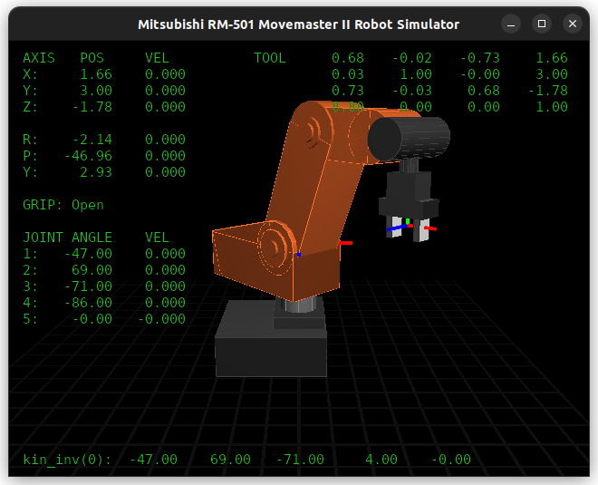
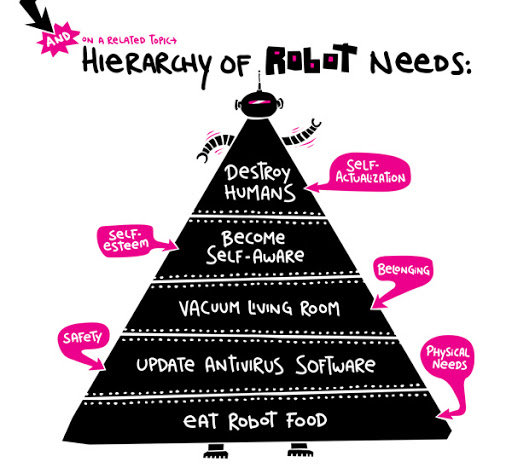

## Features

Working features:

 * [OpenGL](https://www.opengl.org/) GUI,
 * control from [computer keyboard](https://en.wikipedia.org/wiki/Computer_keyboard), [Gamepad](https://en.wikipedia.org/wiki/Gamepad) or [3D mouse](https://en.wikipedia.org/wiki/3Dconnexion),
 * [forward](https://en.wikipedia.org/wiki/Forward_kinematics) and [inverse](https://en.wikipedia.org/wiki/Inverse_kinematics) kinematics ([double precision math](https://en.wikipedia.org/wiki/Double-precision_floating-point_format)),
 * implemented in one [C](https://en.wikipedia.org/wiki/C_(programming_language)) file for simplicity and portability.

Untested / unfinished features:
 
 * [ncurses](https://www.gnu.org/software/ncurses/) UI,
 * control from network via [Internet socket](https://en.wikipedia.org/wiki/Internet_socket),
 * control from [LinuxCNC](http://www.linuxcnc.org/) or [Machinekit](http://www.machinekit.io/) via [HAL](http://linuxcnc.org/docs/html/hal/intro.html).

## Video

[](https://www.youtube.com/watch?v=ddvIzk9aeJo)

## Compile and run

* Required libraries: [OpenGL](https://www.opengl.org/), [SDL2](https://www.libsdl.org/), [SDL2_ttf](https://www.libsdl.org/projects/SDL_ttf/)
* Optional libraries: [ncurses](https://www.gnu.org/software/ncurses/), [libpng](http://www.libpng.org/), [LinuxCNC / Machinekit HAL](http://linuxcnc.org/docs/html/hal/tutorial.html)

```bash
$ sudo apt-get -y install git 
$ git clone https://github.com/koppi/rm501.git
```

```bash
$ sudo apt-get -y install mesa-common-dev libsdl2-dev libsdl2-ttf-dev libsdl2-net-dev
$ sudo apt-get -y install libncurses-dev  libpng-dev
$ sudo apt-get -y install ttf-dejavu-core # for DejaVuSansMono.ttf
```

```bash
$ cd rm501/
$ make
$ ./rm501
```

– Tested on Ubuntu 15.10.

## Control

* Control via keyboard:
  * Q, W, E, R, T – increase the joint values for waist, shoulder, elbow, pitch and roll,
  * A, S, D, F, G – decrease the joint values for waist, shoulder, elbow, pitch and roll,
  * I, K, and direction keys (on your right-hand side): control the end-effector position.
  
* Control via SpaceNavigator
  * see ```HAVE_SPACENAV``` in source code.
  
* Control via Gamepad
  * see ```HAVE_JOYSTICK``` in source code.
  
* Control via network:

```bash
$ socat READLINE,history=$HOME/.rm501_history TCP:127.0.0.1:8888,crlf
```
or
```bash
$ nc localhost 8888 # if the above command does not work for you.
```

Unfinished (see ```HAVE_SOCKET``` in source code).

* Control via LinuxCNC / Machinekit:

Unfinished (see ```HAVE_HAL``` in source code).

## Top 21 Companies in the Industrial Robotics Market

YouTube channels (as of 2015):

* https://www.youtube.com/user/ABBRobotics
* https://www.youtube.com/user/FANUCRoboticsInc
* https://www.youtube.com/user/YaskawaEMECHA
* https://www.youtube.com/user/AdeptRobots
* https://www.youtube.com/user/ApexAutomationRobots
* https://www.youtube.com/user/AurotekCorporation
* https://www.youtube.com/user/axiumautomation
* https://www.youtube.com/user/DENSORobotics
* https://www.youtube.com/user/densoroboticseurope
* https://www.youtube.com/user/ellisontechnologies
* https://www.youtube.com/user/KawasakiRobots
* https://www.youtube.com/user/KukaRobotGroup
* https://www.youtube.com/user/MitsubishiElect
* https://www.youtube.com/user/NachiRobotic
* https://www.youtube.com/user/PARIAutomation
* https://www.youtube.com/user/ReisRoboticsChannel
* https://www.youtube.com/user/ROKAutomation
* https://www.youtube.com/user/SchunkHQ
* https://www.youtube.com/user/StaubliGroup
* https://www.youtube.com/user/TMRobotics1
* https://www.youtube.com/user/YamahaRobotics

## Robotics Art

* [Leonardo Da Vinci](https://www.youtube.com/watch?v=opcpjufSNHM) – [Kraftwerk (1978)](https://www.youtube.com/watch?v=wHEoMpMvz7A)
* [Primitive Technology](https://www.youtube.com/watch?v=nCKkHqlx9dE) – [HomoFaciens](https://www.youtube.com/watch?v=MlR-9Uiab60)
* [Jelle Bakker](https://www.youtube.com/watch?v=VKL4hhNmKLY) – [denha](https://www.youtube.com/watch?v=EPbEnRSS6ow)
* [Drew Berry](https://www.youtube.com/watch?v=dMPXu6GF18M) – [Peter Hoffmann](https://www.youtube.com/watch?v=YdjERhTczAs)
* [Simone Giertz](https://www.youtube.com/watch?v=E2evC2xTNWg) – [Les Baugh](https://www.youtube.com/watch?v=KPhkVPNKtVA)
* [Hugh Herr](https://www.youtube.com/watch?v=CDsNZJTWw0w) – [Samuel Koch](https://www.youtube.com/watch?v=iMmN3TGKavo)
* [Matthew Wilson](https://www.youtube.com/watch?v=Ko0Sd-FzrzI) – [Kevin Warwick](https://www.youtube.com/watch?v=IMf8d5fxNkY)
* [Niklas Roy](https://www.youtube.com/watch?v=lNc2_MXIee4) – [Dr. Guero](https://www.youtube.com/watch?v=FxM40qBK02U)
* [Mike Lewis](https://www.youtube.com/watch?v=aRcXULN6mp4) – [Toy Robot](http://www.ignorancia.org/en/index.php?page=toy-robot)
* [Ray Kurzweil](https://www.youtube.com/watch?v=q86jB4NN-Nc) – [Kraftwerk (2010)](https://www.youtube.com/watch?v=okhQtoQFG5s)
* [2045: A New Era for Humanity](https://www.youtube.com/watch?v=01hbkh4hXEk) — [Noam Chomsky](https://www.youtube.com/watch?v=0kICLG4Zg8s)



## Authors

https://github.com/koppi
