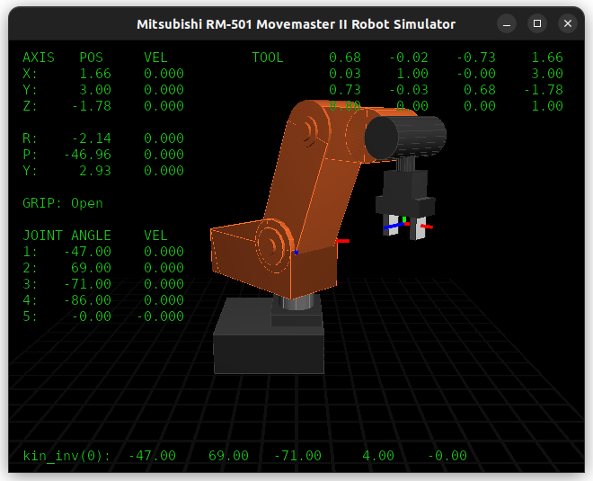

## Features

Working features:

 * [OpenGL](https://www.opengl.org/) GUI,
 * control from [computer keyboard](https://en.wikipedia.org/wiki/Computer_keyboard), [Gamepad](https://en.wikipedia.org/wiki/Gamepad) or [3D mouse](https://en.wikipedia.org/wiki/3Dconnexion),
 * [forward](https://en.wikipedia.org/wiki/Forward_kinematics) and [inverse](https://en.wikipedia.org/wiki/Inverse_kinematics) kinematics ([double precision math](https://en.wikipedia.org/wiki/Double-precision_floating-point_format)),
 * implemented in four [C](https://en.wikipedia.org/wiki/C_(programming_language)) files for simplicity and portability,
 * motor motion sound (see ```HAVE_AUDIO``` in source code).

Untested / unfinished features:

 * [Stefan Wilhelm's trajectory planner](http://atwillys.de/),
 * [ncurses](https://www.gnu.org/software/ncurses/) UI,
 * control from [LinuxCNC](http://www.linuxcnc.org/) or [Machinekit](http://www.machinekit.io/) via [HAL](http://linuxcnc.org/docs/html/hal/intro.html).

## Demo videos

* [Mitsubishi RM-501 Movemaster II Robot Simulator](https://github.com/koppi/rm501/raw/master/doc/rm501.mkv)
* [Test of Stefan Wilhelm's trajectory planner](https://www.youtube.com/watch?v=dLeDPIRKhOw)

## Clone, compile and run

```bash
sudo apt -y install git 
git clone https://github.com/koppi/rm501.git
```

* Required: [OpenGL](https://www.opengl.org/), [SDL2](https://www.libsdl.org/), [SDL2_ttf](https://www.libsdl.org/projects/SDL_ttf/)
* Optional: [ncurses](https://www.gnu.org/software/ncurses/), [libpng](http://www.libpng.org/), [ZeroMQ](http://zeromq.org/), [Eclipse Mosquitto™](https://mosquitto.org/), [LinuxCNC / Machinekit HAL](http://linuxcnc.org/docs/html/hal/tutorial.html)

```bash
# required packages
sudo apt -y install mesa-common-dev libsdl2-dev libsdl2-ttf-dev libsdl2-image-dev
sudo usermod -aG input $USER            # for joystick access
sudo apt -y install fonts-dejavu-core   # for DejaVuSansMono.ttf
# optional packages
sudo apt -y install libncursesw5-dev    # for console
sudo apt -y install libpng-dev          # for screenshots
sudo apt -y install libzmq5 libzmq3-dev # for ZeroMQ
sudo apt -y install libpaho-mqtt-dev    # for Eclipse MQTT
sudo apt -y install mosquitto           # for Mosquitto MQTT server
sudo apt -y install linuxcnc-uspace-dev # for LinuxCNC
```

Compile and run:

```bash
cd rm501/
make
./rm501 -s # start program with SDL GUI
```

– Tested on Windows 2022 [](../../actions/workflows/windows.yml) and Ubuntu 22.04 [](../../actions/workflows/ubuntu.yml).

## Control

* Control via keyboard:

| Key on Keyboard | Emulator Key       |
| --------------- | ------------------ |
| <kbd>⎋ Escape</kbd> | quit the simulator |
| <kbd>⇥ Tab</kbd> | toggle 3D view |
| <kbd>Q</kbd>, <kbd>W</kbd>, <kbd>E</kbd>, <kbd>R</kbd>, <kbd>T</kbd>   | increase the joint values for waist, shoulder, elbow, pitch and roll |
| <kbd>A</kbd>, <kbd>S</kbd>, <kbd>D</kbd>, <kbd>F</kbd>, <kbd>G</kbd>   | decrease the joint values for waist, shoulder, elbow, pitch and roll |
| <kbd>I</kbd> <kbd>K</kbd>, and direction keys (on your right-hand side) | control the end-effector position |
| <kbd>C</kbd>, <kbd>V</kbd>            | move end effector in a circle in the x-y plane, reset circle position |
| <kbd>N</kbd>, <kbd>H</kbd>            | move to 'nest' position, move to the 'all link horizontal' home position |
| <kbd>O</kbd>, <kbd>L</kbd>            | open, close tool |
  
  Hold the shift key to move the joints in parallel, not linearly.
  
* Control via [SpaceNavigator](https://www.3dconnexion.de/):
  
  see ```HAVE_SPACENAV``` in source code.
  
* Control via Gamepad:
  
  see ```HAVE_JOYSTICK``` in source code.
  
* Control via ØMQ

  Unfinished (see ```HAVE_ZMQ``` in source code).

* MQ Telemetry Transport via Eclipse MQTT.

  Partially working (see ```HAVE_MQTT``` in source code).

* Control via LinuxCNC / Machinekit:

  Unfinished (see ```HAVE_HAL``` in source code).

## Authors

* **Jakob Flierl** - [koppi](https://github.com/koppi)


